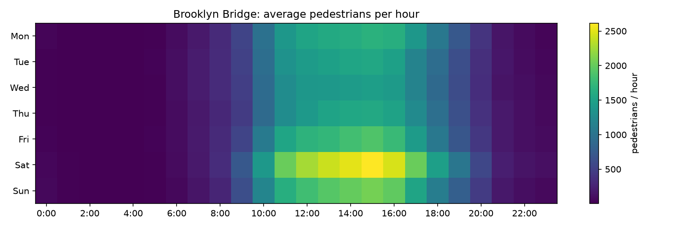
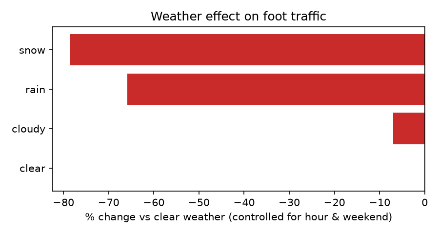
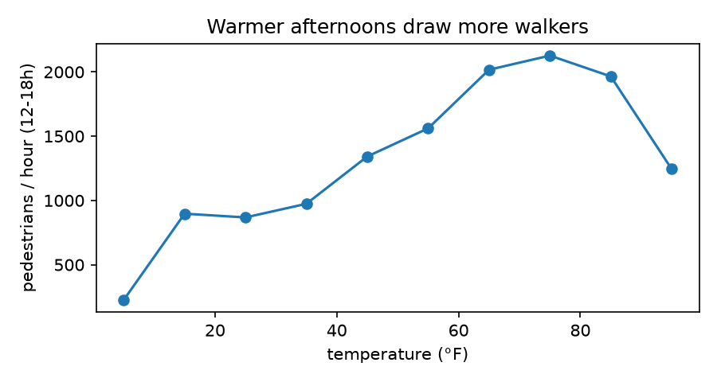

# What drives foot traffic on the Brooklyn Bridge?

[](https://github.com/SnigdhaSrivastva/brooklyn-bridge-pedestrians/actions/workflows/ci.yml)


An analysis of **16,056 hourly pedestrian counts** (Oct 2017 – Dec 2019) from NYC DOT's automated counter on the Brooklyn Bridge, joined with weather. It looks at when people walk the bridge, how much weather really matters once you control for time of day, and how well hourly traffic can be forecast.

> Started as a Data Science Bootcamp assignment at NYU (the original notebook is kept in [`notebooks/`](notebooks/01_original_bootcamp_analysis.ipynb)), then rebuilt as a tested, reproducible analysis with corrected methodology and a forecasting model.



## Key findings

| | Finding |
|---|---|
| **Peak** | The busiest hour is **Saturday 3 PM, averaging 2,616 people/hour**. Saturdays average 943/hour across the day, about 60% more than a Wednesday (575). |
| **Weather** | At the **same hour and day type**, rain cuts traffic by **66%** and snow by **79%** compared with clear weather. Cloud cover costs only about 7%. |
| **Temperature** | Afternoon traffic rises from about 900/hour below 30°F to a peak of about **2,100/hour at 70–80°F**, then falls again above 90°F. |
| **Forecast** | A gradient-boosted model of hourly traffic gets **MAE 207 people/hour (R² 0.85)** on the last 20% of the timeline, **34% lower error** than a seasonal weekday × hour baseline. |

<p>
  
  
</p>

## Methodology: what changed from the original assignment

1. **Averages, not totals.** The original summed counts per weekday. Weekdays have different numbers of recorded hours, so a sum partly measures data coverage. Averaging per hour fixes that, and it changes the order of Tuesday and Thursday.
2. **Clean before analyzing.** Duplicate hours are removed and hours with no count are dropped, instead of counted twice or treated as zero.
3. **Control for confounding.** Raw averages make rain look worse than it is, because rain is more common at night when the bridge is empty anyway. Weather effects here compare each condition with clear weather **at the same hour and weekday/weekend**, weighted by hours observed.
4. **Correlation → prediction.** Instead of a correlation heatmap of one-hot weather columns, a forecasting model is evaluated **chronologically**: it trains on the past and is tested on later months, never on shuffled rows. It's compared against a strong seasonal baseline, not a trivial one.
5. **Holidays and events** are added as features using the US federal holiday calendar.

## Run it

```bash
pip install -e ".[dev]"
PYTHONPATH=src python -m bridge.report     # prints every number above and writes figures/
pytest                                     # 7 tests on synthetic data with known answers
```

The dataset is cached in `data/` for reproducibility. `bridge.data.load(refresh=True)` re-downloads it from [NYC Open Data](https://data.cityofnewyork.us/Transportation/Brooklyn-Bridge-Automated-Pedestrian-Counts-Demons/6fi9-q3ta).

## Tests

The tests use **synthetic data with known answers**, so they check that the methods are correct, not just that the code runs:
- the weather analysis recovers a planted **-50% rain effect** within ±4 points
- weekday averages ignore duplicated days that would inflate totals
- the chronological split never leaks future rows
- the model beats the seasonal baseline when weather matters
- cleaning drops missing counts and removes duplicate hours
- holiday detection works even on the first day of the data (a bug these tests caught and that's now fixed)

## Tech

Python 3.11 · pandas · NumPy · scikit-learn (HistGradientBoostingRegressor) · matplotlib · pytest · ruff · GitHub Actions
